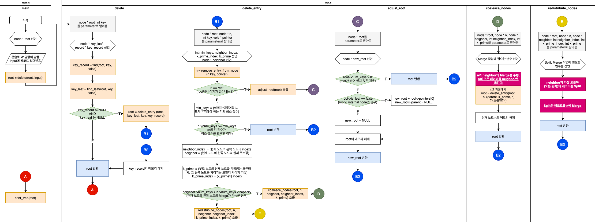
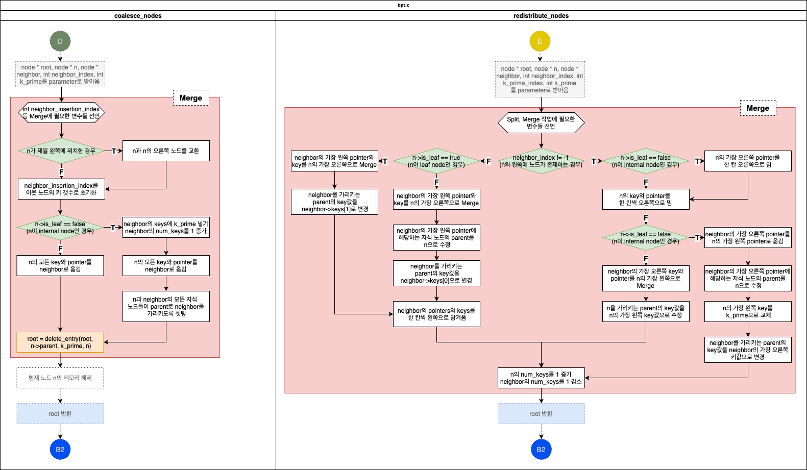

# Delete 관련 함수
`int get_neighbor_index( node * n )` : 삭제 작업을 위한 helper function. 주어진 노드의 왼쪽에 이웃한 노드의 index값을 찾아서 반환한다. 만약 주어진 노드가 가장 왼쪽에 있는 노드라면, -1을 반환한다.

`node * remove_entry_from_node(node * n, int key, node * pointer)` : key와 pointer를 주어진 노드 n에서 제거한다. 여기서는 제거한 이후 n의 keys와 pointers 배열을 한 칸씩 왼쪽으로 당겨주는 처리도 한다.

`node * adjust_root(node * root)` : root에서 삭제가 일어난 경우, root에서 삭제가 일어난 뒤의 처리를 담당하는 함수. root가 비게 되는 경우, 기존 root의 0번째 자식 노드를 새로운 root로 반환한다. 만약 root의 자식 노드도 존재하지 않는다면, B+ Tree 자체가 빈 것이므로 NULL을 반환한다.

`node * coalesce_nodes(node * root, node * n, node * neighbor, int neighbor_index, int k_prime)` : merge 함수. 주어진 노드에서 삭제를 수행할 시 해당 노드의 키 갯수가 각 노드가 지켜야 할 최소한의 키 갯수보다 적어지고, 주어진 노드와 이웃 노드의 병합이 가능할 때, 주어진 노드에서 삭제 처리를 한 뒤에 호출된다. 삭제 처리가 끝난 현재 노드와 이웃 노드를 병합한다.

`node * redistribute_nodes(node * root, node * n, node * neighbor, int neighbor_index, int k_prime_index, int k_prime)` : merge와 split을 같이 처리하는 함수. 주어진 노드에서 삭제를 수행할 시 해당 노드의 키 갯수가 각 노드가 지켜야 할 최소한의 키 갯수보다 적어지고, 주어진 노드와 이웃 노드의 병합이 불가능할 때, 주어진 노드에서 삭제 처리를 한 뒤에 호출된다. 이웃 노드의 가장 오른쪽(또는 왼쪽) key와 pointer를 주어진 노드의 가장 왼쪽(또는 오른쪽)에 붙인다. 이웃 노드에서 값을 하나 분리하면서 split이 수행되고, 분리한 값을 주어진 노드에 붙이면서 merge가 수행된다.

`node * delete_entry( node * root, node * n, int key, void * pointer )` : 주어진 레코드와 그 레코드의 key, pointer를 삭제하는 함수. leaf에서 주어진 레코드를 찾아서 삭제하고, 이후 경우에 따라 위의 함수들을 호출함으로써 삭제가 수행된 이후에도 B+ Tree의 성질이 깨지는 것을 방지한다.

`node * delete( node * root, int key )` : 삭제의 master function. main 함수에서 삭제 작업을 요청하면 이 함수가 가장 먼저 실행된다. key에 해당하는 레코드와 그 레코드를 가지고 있는 leaf를 찾아서, 만약 해당하는 레코드와 leaf가 있다면 delete_entry를 호출한다.

`void destroy_tree_nodes(node * root)` : destroy_tree의 helper function. B+ Tree의 모든 노드를 메모리에서 해제한다.

`node * destroy_tree(node * root)` : B+ Tree의 모든 노드를 메모리에서 해제한다. main 함수에서 트리 삭제 작업을 요청하면 이 함수가 실행된다.

# Delete의 Call Path

※ Merge 작업은 제외하고 서술함. Merge 과정은 아래에서 자세히 서술.

※ redistribute_nodes는 Split과 Merge가 같이 이루어지는데, Merge 작업에 더 가깝다고 생각해서 Merge에서 서술했습니다.

# Merge 작업이 실행되는 함수
`node * coalesce_nodes(node * root, node * n, node * neighbor, int neighbor_index, int k_prime)` : 삭제 작업이 이루어진 노드와 그 이웃 노드를 merge하는 작업이 있다.

`node * redistribute_nodes(node * root, node * n, node * neighbor, int neighbor_index, int k_prime_index, int k_prime)` : 삭제 작업이 이루어져서 record의 갯수가 부족해진 노드가 있을 때, 이 노드의 이웃 노드에서 가장 왼쪽이나 오른쪽 key와 pointer를 가져와서 삭제가 이루어진 노드에 붙이는 함수. 이 때 이웃 노드에서 가져온 key와 pointer를 삭제 작업이 이루어진 노드에 붙일 때 merge가 이루어진다.

# Merge의 Detail Flow

